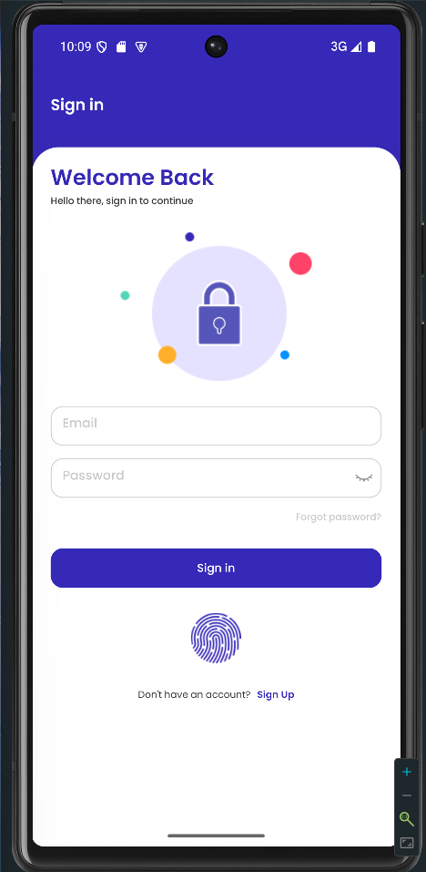
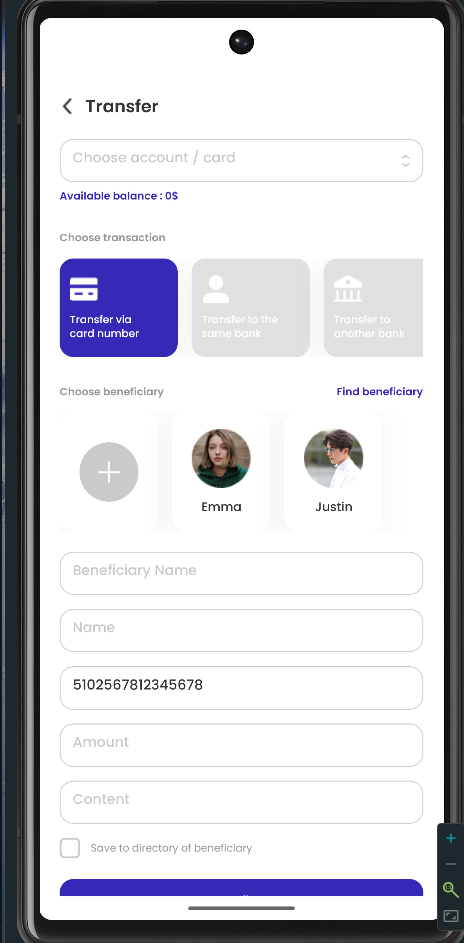
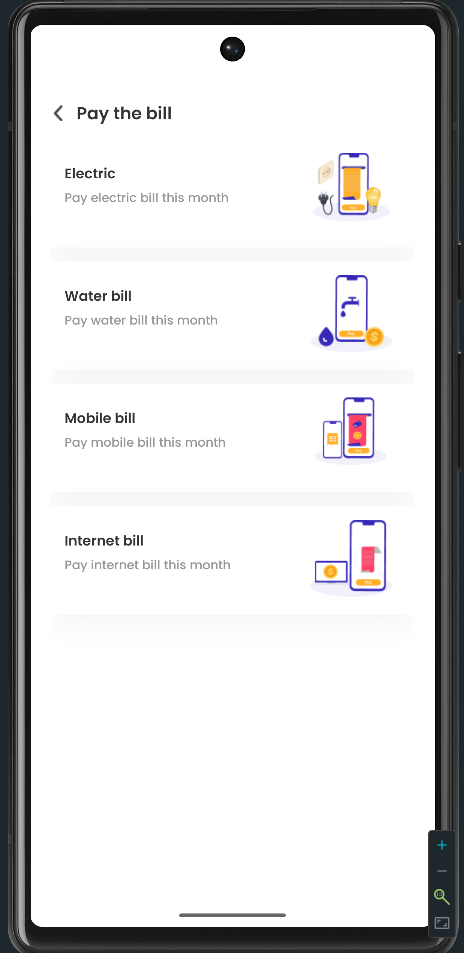

# iBank Mobile App | React Native & Expo

[](https://expo.dev/)
[](https://reactnative.dev/)
[](https://www.typescriptlang.org/)
[](https://firebase.google.com/)
[](https://tailwindcss.com/)

Une application bancaire mobile développée avec **React Native** et **Expo**. Ce projet permet d'explorer les opérations financières, la gestion d'état, l'authentification biométrique et la création d'interfaces à partir de maquettes Figma.

**Maquette de référence :** [Figma Design Link](https://www.figma.com/design/crH5PYYpCaGiSmxJD82ydg/iBank---Banking---E-Money-Management-App-%7C-FinPay-%7C-Digital-%7C-Finance-Mobile-Banking-App-Ui-Kit--Community-?node-id=2-20347&t=NPe8oAF4tBk86Krq-0)

---

## Aperçu de l'Interface

|                Authentication & Account                 |                      Banking Operations                      |                   Transactions & Services                   |
| :-----------------------------------------------------: | :----------------------------------------------------------: | :---------------------------------------------------------: |
|  |  |  |
|         _Authentification & Gestion de Compte_          |                _Transferts & Retraits animés_                |                _Paiement factures & Épargne_                |

---

## Fonctionnalités

### Authentification & Sécurité

- **Authentification biométrique** : Connexion par empreinte digitale ou FaceID avec `expo-local-authentication`.
- **Stockage sécurisé** : Les tokens JWT sont stockés de manière sécurisée avec `expo-secure-store`.
- **Gestion de session** : État utilisateur centralisé avec Zustand et récupération de mot de passe via Firebase.

### Opérations Bancaires

- **Transferts d'argent** : Interface pour transférer de l'argent, sélectionner des bénéficiaires et vérifier avec OTP.
- **Retraits** : Retrait d'argent avec validation du montant.
- **Recharge mobile** : Recharge de forfaits prépayés.
- **Paiement de factures** : Paiement d'électricité, eau, internet et téléphone.
- **Épargne en ligne** : Gestion des plans d'épargne.

### Services Supplémentaires

- **Change de devises** : Consultation des taux de change en temps réel.
- **Localisateur de succursales** : Affichage des succursales bancaires sur une carte avec calcul de distance.
- **Historique des transactions** : Affichage et filtrage des transactions passées.
- **Gestion des bénéficiaires** : Ajouter, modifier et supprimer des bénéficiaires.

### Expérience Utilisateur

- **Design réactif** : L'interface s'adapte à différentes tailles d'écrans (téléphones et tablettes).
- **Navigation** : Navigations fluides entre les écrans avec Expo Router.
- **Retours haptiques** : Vibrations pour donner du retour utilisateur.
- **Plusieurs langues** : Sélection de la langue dans l'application.
- **Mode clair et sombre** : Support du mode sombre.

---

## Stack Technique

| Aspect          | Technologies                                                                                                                           |
| --------------- | -------------------------------------------------------------------------------------------------------------------------------------- |
| **Framework**   | [Expo](https://expo.dev/) (SDK 54) et React Native 0.81                                                                                |
| **Langage**     | [TypeScript 5.9](https://www.typescriptlang.org/) pour plus de stabilité                                                               |
| **État global** | [Zustand 5](https://github.com/pmndrs/zustand) pour gérer l'état de l'application                                                      |
| **Styles**      | [NativeWind 4.2](https://www.nativewind.dev/) (Tailwind CSS pour mobile) et Tailwind CSS 3.4                                           |
| **Formulaires** | [React Hook Form 7.71](https://react-hook-form.com/) et [Zod 4.3](https://zod.dev/) pour valider les données                           |
| **Backend**     | [Firebase 12.10](https://firebase.google.com/) pour authentication et base de données                                                  |
| **Navigation**  | [Expo Router 6.0](https://docs.expo.dev/router/introduction/) pour naviguer entre les écrans                                           |
| **Sécurité**    | `expo-secure-store` et `expo-local-authentication` pour stocker et vérifier les données sensibles                                      |
| **Cartes**      | [React Native Maps 1.20](https://github.com/react-native-maps/react-native-maps) et [Geolib 3.3](https://www.npmjs.com/package/geolib) |
| **Animations**  | [React Native Reanimated 4.1](https://www.swmansion.com/reanimated) pour animer les transitions                                        |
| **HTTP Client** | [Axios 1.13](https://axios-http.com/) pour faire des requêtes à une API                                                                |
| **Utilitaires** | `date-fns` pour les dates, `clsx` pour le CSS conditionnel, `expo-location` pour la géolocalisation                                    |

---

## Architecture du Projet

Le projet est organisé avec une structure modulaire :

```text
├── app/                          # Expo Router - Navigation basée fichiers
│   ├── (auth)/                   # Routes authentification
│   │   ├── login.tsx
│   │   ├── sign-up.tsx
│   │   └── forget-password.tsx
│   ├── (tabs)/                   # Navigation par onglets
│   │   ├── home.tsx
│   │   ├── message.tsx
│   │   ├── search.tsx
│   │   └── setting.tsx
│   ├── (home-menus)/             # Opérations bancaires
│   │   ├── transfert.tsx / confirm-transfert.tsx
│   │   ├── withdraw.tsx
│   │   ├── mobile-prepaid.tsx / confirm-mobile-prepaid.tsx
│   │   ├── pay-the-bill.tsx / [bill-type].tsx
│   │   ├── save-online.tsx
│   │   ├── account-and-card.tsx
│   │   └── beneficiary.tsx
│   ├── (search-menus)/           # Recherche et services
│   │   ├── exchange.tsx
│   │   ├── branch.tsx
│   │   ├── interest-rate.tsx
│   │   └── language.tsx
│   ├── (pay-the-bill)/           # Paiement factures
│   ├── (save-online)/            # Épargne
│   ├── (message)/                # Messagerie
│   ├── (setting)/                # Paramètres
│   ├── _layout.tsx               # Root layout
│   └── index.tsx                 # Entry point
│
├── components/                   # Composants réutilisables
│   ├── ui/                       # Composants atomiques (Buttons, Inputs, Cards)
│   ├── account_and_card/         # Logique compte/cartes
│   ├── transfer/                 # Logique transferts
│   ├── exchange/                 # Logique change
│   ├── branch/                   # Logique localisateur
│   ├── message/                  # Composants chat
│   ├── save-online/              # Logique épargne
│   ├── interest/                 # Logique taux
│   ├── language/                 # Sélecteur langue
│   ├── card/                     # Composants cartes
│   ├── MenuCard.tsx              # Menu principal
│   └── SearchMenu.tsx            # Barre recherche
│
├── services/                     # Logique métier
│   ├── auth.service.ts           # Firebase Auth
│   ├── biometric.service.ts      # Authentification biométrique
│   ├── exchange.service.ts       # APIs change devises
│   └── secure-storage.service.ts # Stockage sécurisé tokens
│
├── store/                        # État global Zustand
│   ├── auth.store.ts             # État utilisateur
│   ├── transfer.store.ts         # État transferts
│   ├── mobile-prepaid-store.ts   # État recharges
│   └── save-online.store.ts      # État épargne
│
├── hooks/                        # Hooks personnalisés
│   ├── useAuth.ts
│   ├── useBiometricAuth.ts
│   ├── useLoginForm.ts
│   └── useUserLocation.ts
│
├── schemas/                      # Validations Zod
│   ├── auth.schema.ts
│   ├── transfer.schema.ts
│   ├── mobile-prepaid.schema.ts
│   ├── pay-the-bill.schema.ts
│   ├── save-online.schema.ts
│   └── withdraw.schema.ts
│
├── types/                        # Définitions TypeScript
│   ├── auth.types.ts
│   ├── user.types.ts
│   └── ui.types.ts
│
├── constants/                    # Données statiques
│   ├── theme.ts                  # Icônes, couleurs, styles
│   └── data.ts                   # Données fixtures
│
├── utils/                        # Utilitaires
│   ├── errorsHandler.ts          # Gestion erreurs Firebase
│   ├── format.ts                 # Formatage (devise, date)
│   └── validators.ts             # Validations métier
│
├── styles/                       # Styles globaux
│   └── global.css                # Directives Tailwind
│
├── assets/                       # Ressources visuelles
│   ├── fonts/                    # Poppins (17 variantes)
│   ├── icons/                    # Icônes (50+ PNG)
│   ├── images/                   # Images
│   └── screenshots/              # Screenshots README
│
└── config/                       # Configuration
    ├── firebase.ts               # Firebase initialization
    └── ...
```

---

## Installation et Lancement

### Prérequis

- Node.js 18 ou plus
- Expo CLI
- Un compte Firebase

### Étape 1 : Cloner et Installer

```bash
git clone https://github.com/gery-guedegbe/ibank-mobile-app.git
cd ibank-mobile-app
npm install
```

### Étape 2 : Configuration Firebase

Voir [SETUP.md](./SETUP.md) pour configurer Firebase et les variables d'environnement.

```bash
cp .env.example .env.local
# Puis ajouter les clés Firebase
```

### Étape 3 : Lancer l'Application

```bash
npm start
```

Dans le terminal, appuyez sur :

- `i` pour iOS
- `a` pour Android
- `w` pour Web

---

## Commandes

```bash
npm run lint           # Vérifier le code
npm run reset-project  # Réinitialiser le projet
npm run android        # Lancer sur Android
npm run ios            # Lancer sur iOS
npm run web            # Lancer sur Web
```

---

## Points Techniques Importants

### Authentification

Authentification par empreinte digitale ou FaceID avec stockage sécurisé des tokens.

### Gestion d'État

Utilisation de Zustand pour partager l'état (transferts, retraits, épargne) entre les écrans.

### Formulaires

Validation des données avec React Hook Form et Zod pour s'assurer que les informations saisies sont correctes.

### Design Réactif

L'interface s'adapte à tous les types d'écrans : téléphones petits, grands et tablettes.

### Cartes et Distance

Affichage des succursales bancaires sur une carte et calcul de la distance avec l'utilisateur.

### Listes d'Historique

Optimisation de l'affichage des nombreuses transactions passées.

### Conversion de Maquettes Figma

Transformation des designs Figma en code React Native avec attention aux détails.

---

## Documentation

- **[SETUP.md](./SETUP.md)** - Configuration Firebase et variables d'environnement
- **[SECURITY.md](./SECURITY.md)** - Meilleures pratiques de sécurité

---

## Ce Qui a Été Appris

- Expo Router pour naviguer entre les écrans
- Zustand pour partager l'état entre composants
- NativeWind pour appliquer facilement des styles
- Firebase pour l'authentification et la base de données
- React Hook Form pour gérer les formulaires
- Authentification biométrique sur mobile
- Comment faire une interface qui s'adapte à tous les écrans
- TypeScript pour écrire du code plus stable

---

## Licence

Ce projet est sous licence MIT - voir le fichier [LICENSE](./LICENSE) pour plus de détails.

---

## Contribution

Les contributions sont bienvenues ! Veuillez :

1. Fork le projet
2. Créer une branche (`git checkout -b feature/amazing-feature`)
3. Commit vos changements (`git commit -m 'Add amazing feature'`)
4. Push vers la branche (`git push origin feature/amazing-feature`)
5. Ouvrir une Pull Request

---

## Contact

**Développeur** : [Géry GUEDEGBE](https://github.com/gery-guedegbe)

---

Merci d'avoir consulté ce projet.
